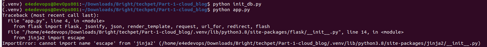
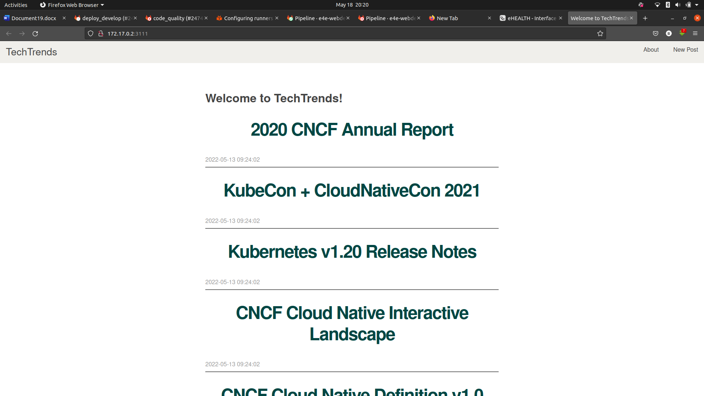
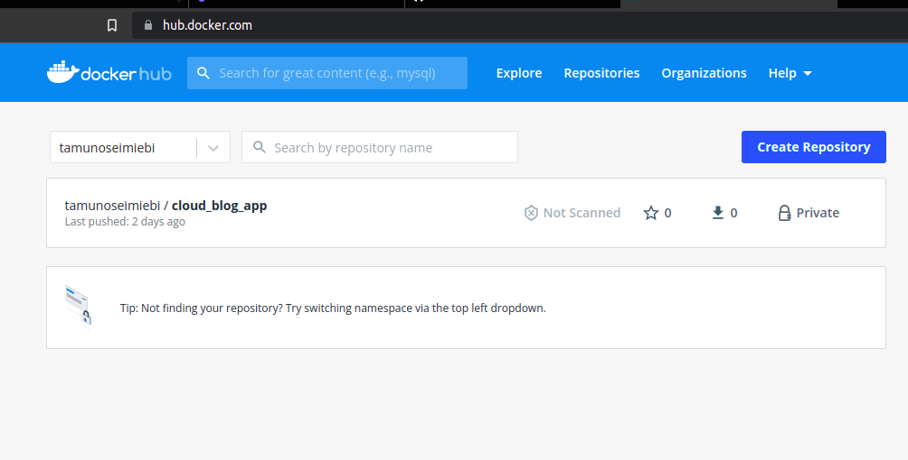

## Techpet Global DevOps Interns Challenge Part 1

### Cloud Blog Web Application

This is a Flask application that lists the latest articles within the cloud-native ecosystem.  

*Instructions:*

1. Fork this repo
2. Create an optimized dockerfile to dockerize the application.
3. Use any CICD tool of your choice, create a pipeline that will dockerize and deploy to your docker hub.
4. Create your own Readme.md file to document the process and your choices.

***

### Task 1: Dockerize the App

1. Clone the forked repo with the following command:

	 	git clone https://github.com/Tamunoseimiebi/Part-1-cloud_blog.git
	 
	
	
2. Create a Dockerfile inside the project directory with your favourite editor:

		nano Dockerfile

		
 Paste the following inside the Dockerfile	

		# syntax=docker/dockerfile:1

		FROM python:3.8-slim-buster

		WORKDIR /Part-1-cloud_blog

		COPY requirements.txt requirements.txt
		RUN pip3 install -r requirements.txt

		COPY . .

		CMD [ "python", "init_db.py" ]

		CMD [ "python", "app.py"]
	
	
	
3. Save file and exit

***

### Dockerfile explained:

- FROM python:3.8-slim-buster: This line tells Docker which base image to use

- WORKDIR /Part-1-cloud_blog: This command is used to define the working directory of the Docker container

- COPY requirements.txt requirements.txt: is used to copy the contents of our requirements.txt file into the container image's  requirements.txt file. 

- RUN pip3 install -r requirements.txt:  THis command is used to install all required dependencies.

- COPY . .   Here we are telling Docker to copy all the  files in our local working directory to the directory in the docker image.

- CMD [ "python", "init_db.py" ]  This commands Docker to initialize the database file "database.db".

- CMD [ "python", "app.py"] Ths command is used to start the application.

***

With our Dockerfile set up, the next step is to build our docker image with this command:

		docker build --tag cloud_blog_app .

4. Run the app to test if it works:

 		docker run cloud_blog_app

***

If you get this error "ImportError: cannot import name 'escape' from 'jinja2' " Update flask and Werkzeug packages in the requirements file to a stable  version. In my case  Flask==2.1.0 and Werkzeug==2.0.0 solved this problem.

5. Run docker build command again:  
  
   	  	docker run cloud_blog_app 

The app should run successfully and be available at http://localhost:3111

   
  
***

### Task 2: CI/CD FIle to dockerize the app and publish to Dockerhub

1.  Create a .github/workflows folder.

		mkdir -p .github/workflows
	
	
2. Create a .yml file for the pipeline. e.g flask-image.yml

	       nano .github/workflows/flask-image.yml

3. Paste in the following code into the file:

		name: Dockerhub CI/CD
		on:
		  push:
		    branches:
		      - main
		# Env variable
		env:
		  DOCKER_USER: ${{secrets.DOCKER_USER}}
		  DOCKER_PASSWORD: ${{secrets.DOCKER_PASSWORD}}
		  REPO_NAME: ${{secrets.REPO_NAME}}
		jobs:
		  build-image-and-push-image:  # job name
		    runs-on: ubuntu-latest  # runner name : (ubuntu latest version) 
		    steps:
		    - uses: actions/checkout@v2 # first action : checkout source code
		    - name: docker login
		      run: | # log into docker hub account
			docker login -u $DOCKER_USER -p $DOCKER_PASSWORD  
		    - name: Build the Docker image # push The image to the docker hub
		      run: docker build . --file Dockerfile --tag tamunoseimiebi/cloud_blog_app
		    - name: Docker Push
		      run: docker push tamunoseimiebi/cloud_blog_app

Image of the deployed docker image:

### CI/CD File explained:

The CI/CD file has three major segmesnts namely: name, env and jobs.

-  Name: Contains useful information that describes when the pipeling is triggered and what github branch triggers it.

-  Env:  Refers to useful environment variables needed to connect to docker hub.

-  jobs: Refers to stages of the pipeline. The pipepline first builds the Dockerfile whenever a commit is made on the main branch 
         and then pushes the generated docker image to Docker Hub.

